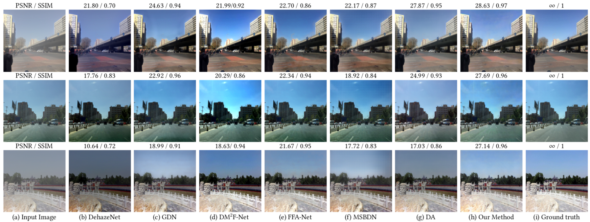
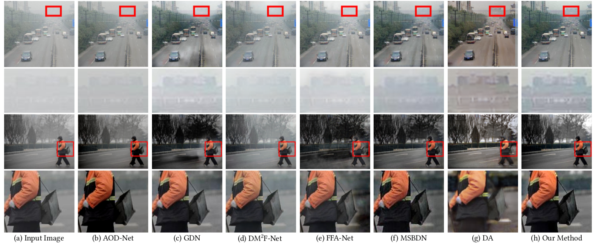

# From Synthetic to Real: Image Dehazing Collaborating with Unlabeled Real Data
Official implementation of From Synthetic to Real: Image Dehazing Collaborating with Unlabeled Real Data(ACM MM 2021)
[arXiv link](https://arxiv.org/abs/2108.02934)
# Citation
@inproceedings{liu21DMT-Net,    
&nbsp;&nbsp;&nbsp;&nbsp;author = {Liu, Ye and Zhu, Lei and Pei, Shunda and Fu, Huazhu and Qin, Jing and Zhang, Qing and Wan, Liang and Feng, Wei},  
&nbsp;&nbsp;&nbsp;&nbsp;title = {From Synthetic to Real: Image Dehazing Collaborating with Unlabeled Real Data},      
&nbsp;&nbsp;&nbsp;&nbsp;booktitle = {ACM MM},   
&nbsp;&nbsp;&nbsp;&nbsp;year = {2021}      
}

# Haze4K dataset
Haze4K dataset is available at **[Haze4K link](https://pan.baidu.com/s/141MW0YAvjFcydlroQZZizA)(pw: cmmr)**

# Results in SOTS, Haze4K and HazeRD datasets
 ## Quantitative Results

 

 ## Visual Results on synthetic dataset Haze4K

 ## Visual Results on real world images

